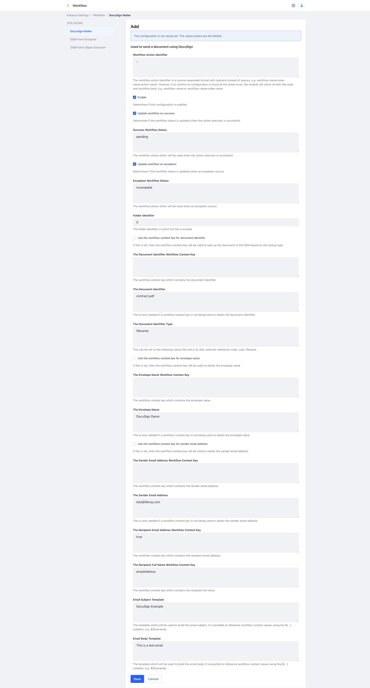

# DocuSign Workflow Extension

A DocuSign extension for Liferay Workflow.

This extension also serves as an example of how a new Workflow Extension can be created.

## Usage

This module is used to send a document to a recipient for electronic signature using Liferay's DocuSign feature.

This extension is dependent on
the [DocuSign](https://learn.liferay.com/dxp/latest/en/content-authoring-and-management/documents-and-media/uploading-and-managing/enabling-docusign-digital-signatures.html)
feature being configured.

The module can be configured on a per form instance basis.



## Enable Logging

The base package of this extension is com.liferay.workflow, as it is for
the [Liferay Workflow Extensions](https://github.com/peterrichards-lr/liferay-workflow-extensions). Therefore, the same
logger can be used for all of these extensions.

## Dependencies

### Liferay Version

These extensions have been tested with 7.4 U92.

### Workflow Extensions Common

The DocuSign extension has a direct dependency on the Workflow Extensions Common module. This module provides common
functionality required by the majority the other modules.

This module is required when compiling the code and at runtime. The [section](#create-a-new-workflow-extension) which
covers how to create a new Workflow Extension details how this dependency should be resolved.

## Example Workflow

The following example is based on an on-boarding use case.

[Use case example](example/README.md)

## Create a new Workflow Extension

### Maven Local

Currently, the best way to satisfy the dependency on the Workflow Extensions Common module is via Maven Local. You will
see in the build.gradle the mavenLocal() directive has been used to indicate that Gradle should look within the local
.m2 repository to resolve dependencies.

In order for the module to be present in the .m2 repository, it is necessary to clone
the [Liferay Workflow Extensions](https://github.com/peterrichards-lr/liferay-workflow-extensions) repository and
install the Workflow Extensions Common module.

Within the directory of the workflow-extensions-common module, run a **gw clean build install**

After which you need to add the dependency to module build.gradle. For example, the following line from this module
tells Gradle that is has a dependency on version 9.0.0.

```
compileOnly group: "com.liferay.sales.engineering", name: "com.liferay.workflow.extensions.common", version: "9.0.0"
```

### Module Structure

This is the typical module structure for a Workflow Extension module.

```
.
└── src
    └── main
        ├── java
        │   └── com
        │       └── liferay
        │           └── workflow
        │               └── docusign
        │                   ├── action
        │                   │   └── executor
        │                   │       └── DocuSignMailer.java
        │                   ├── configuration
        │                   │   ├── DocuSignMailerConfiguration.java
        │                   │   ├── DocuSignMailerConfigurationWrapper.java
        │                   │   └── listener
        │                   │       └── DocuSignMailerConfigurationModelListener.java
        │                   ├── constants
        │                   │   └── DocuSignMailerConstants.java
        │                   └── settings
        │                       ├── DocuSignMailerSettingsHelper.java
        │                       └── DocuSignMailerSettingsHelperImpl.java
        └── resources
            └── content
                └── Language.properties
```