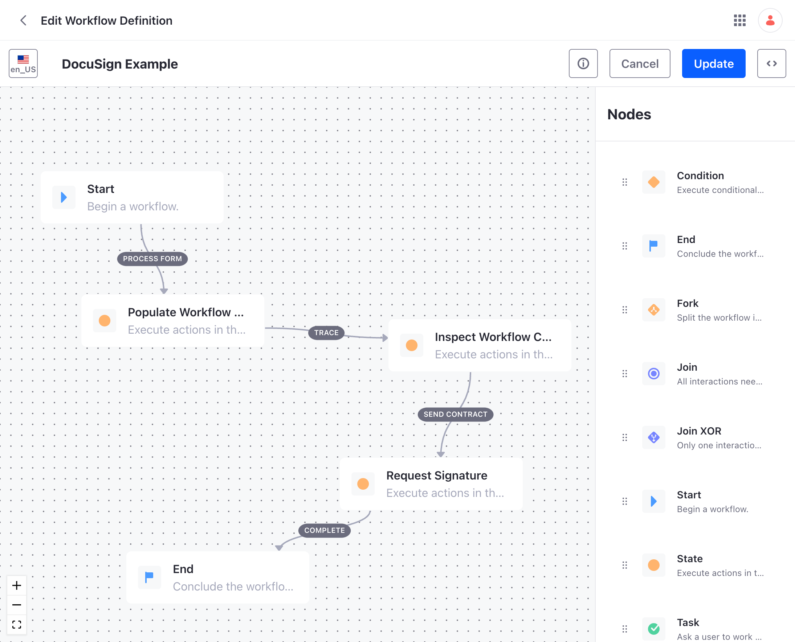

## Use Case Example

[Download Workflow](docusign.xml "download")

## Dependencies

This example requires you to have an account with DocuSign.

### OSGi Configuration Files

The component configuration for this workflow can be found in the [config](config) folder

### Form Definition

There are two fields, which are key to this example, the recipient's full name and email address. These fields are used by DocuSign to send the document which requires the digital signature.

### Workflow Definition

The workflow extracts the form data and then passes it onto the DocuSign service within Liferay DXP.